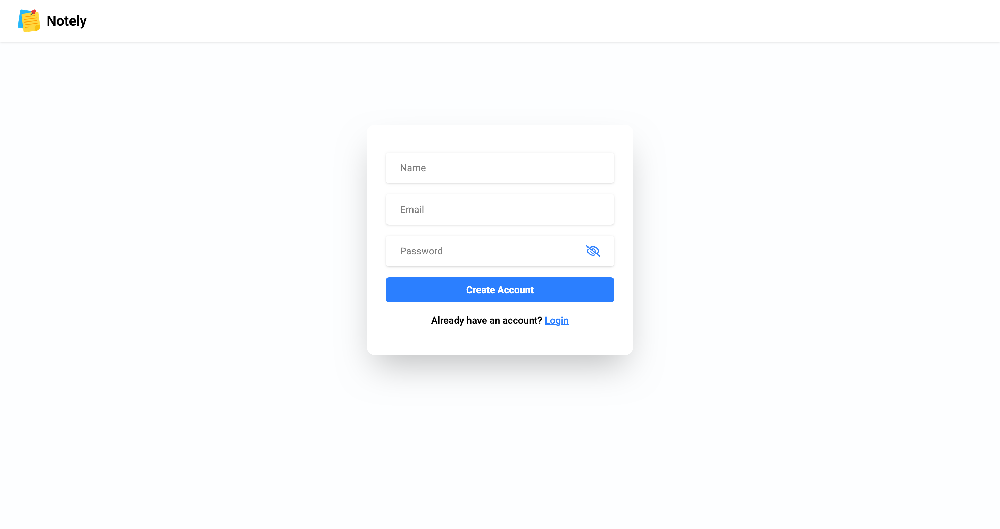
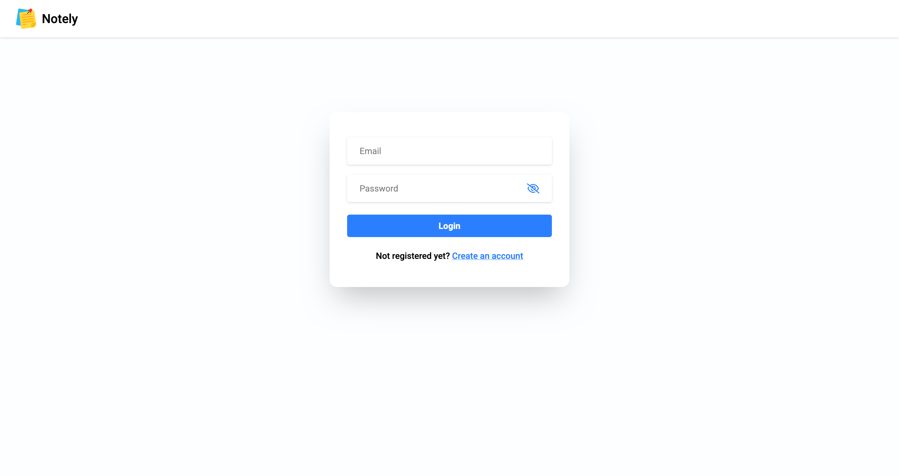
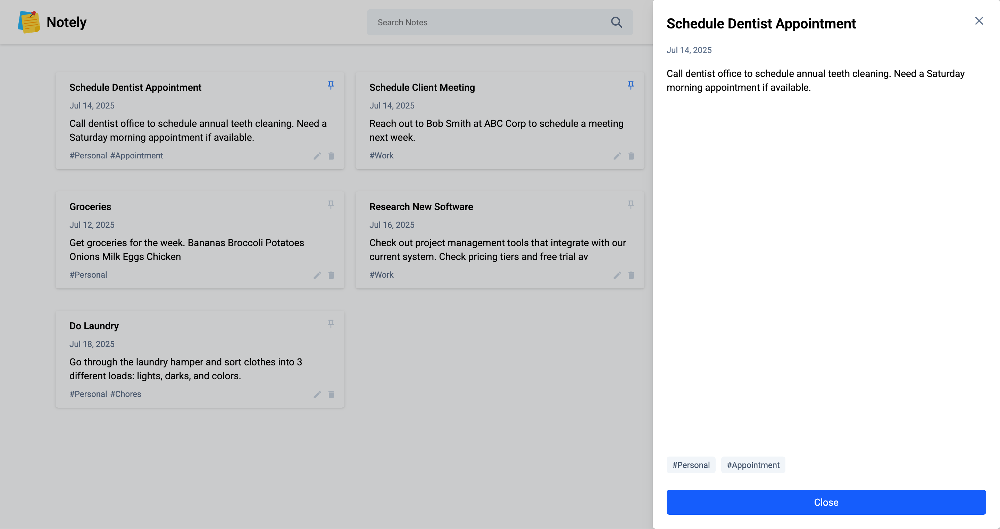
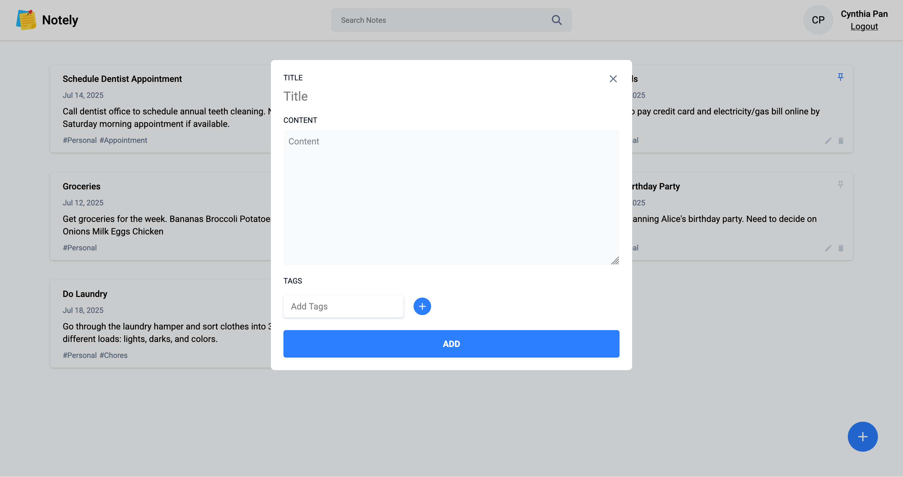

# Notely

Notely is a full stack note management web application built with **React**, **Tailwind CSS**, **Node.js**, and **MongoDB**. Users can sign up, create/edit/delete/pin/search notes, and stay logged in securely using JWT authentication with refresh tokens stored in HTTP-only cookies.

The app is deployed on the frontend with GitHub Pages and Render in the backend and can be accessed [here](https://pan-cynthia.github.io/notely/).

## Preview







## Tech Stack

### Frontend
  - React - Component based UI
  - Axios - API communication
  - React Router - Client side routing
  - Tailwind CSS - Styling and responsive design

### Backend
  - Node.js & Express - RESTful API and server logic
  - MongoDB (Mongoose) - Database and Schema modeling
  - jsonwebtoken (JWT) - Secure authentication

### Deployment
  - GitHub Pages (Frontend)
  - Render (Backend)

## Note

The backend is hosted on a free Render service that goes to sleep when inactive.

If the frontend (GitHub pages) appears blank, please visit the backend once to wake it up:

[Backend API](https://notely-zovf.onrender.com/)

After ~30 seconds, refresh the frontend and it should load correctly.

## Getting Started

### Installation

To install and run the app locally, follow these steps in your terminal:

#### 1. Clone the repository

```bash
git repo clone https://github.com/pan-cynthia/notely.git
cd notely
```

#### 2. Install dependencies

```bash
cd backend
npm install

cd ../frontend
npm install
```

#### 3. Configure environment variables
Copy the example env file and fill in your own values
- `MONGODB_URI` - Your MongoDB connection string
- `ACCESS_TOKEN_SECRET` and `REFRESH_TOKEN_SECRET` - Generate random 32-byte strings (see below)
- `FRONTEND_URL` - `http://localhost:5173` (for local development)
- `NODE_ENV` - development

To generate random secrets
```bash
node -e "console.log(require('crypto').randomBytes(32).toString('hex'))"
```

Paste the results into .env
```
cp .env.example .env
```

#### 4. Start the development server

```bash
cd backend
npm start
```

Backend should be up and running on http://localhost:3000

#### 5. Run the frontend
In a new terminal:

```
cd frontend
npm run dev
```
Frontend should be running at http://localhost:5173

---
